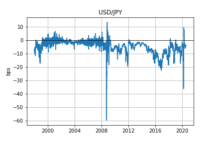

# cross-currency-basis

Attempt to recreate the cross-currency basis using this <a href='https://www.bis.org/publ/qtrpdf/r_qt1609e.htm'>article</a> from the BIS, but including more recent data. Specifically, graph 1 is of interest: 

All data is obtained from datastream. FX data are the WM Reuters series, or Refinitiv series. Results using both series differ a lot. The following graphs are the USD/EUR and USD/JPY cross-currency bases respectively. Compared with graph 1 from the BIS article (on the 2006-2016 sample) shows that my calculations are still off, although the shape is somewhat similar. 

